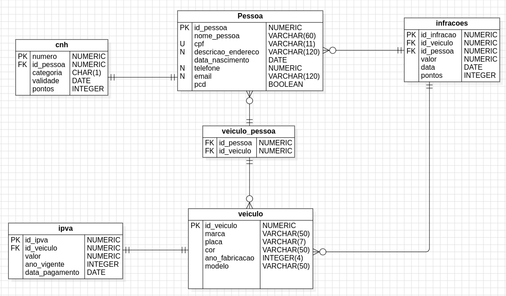

# Detran API UPF

Este projeto é uma "cópia" da API do Detran, que fornece informações sobre veículos, motoristas e outros dados relacionados.

## Começando

Para clonar e executar este projeto localmente, siga estas etapas:

1. Clone o repositório:
    ```bash
    git clone <repository_url>
    ```

2. Navegue até o diretório do projeto:
    ```bash
    cd detran-upf
    ```

3. Instale as dependências:
    ```bash
    npm install
    ```

4. Inicie o servidor:
    ```bash
    npm run dev
    ```
PS: Utilize o gerenciador de pacotes que preferir.

## Schema do banco de dados


