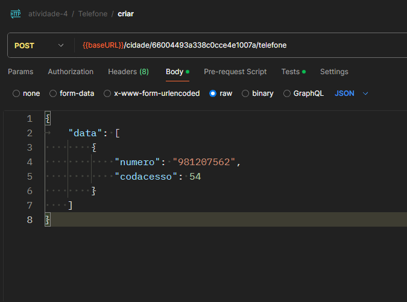
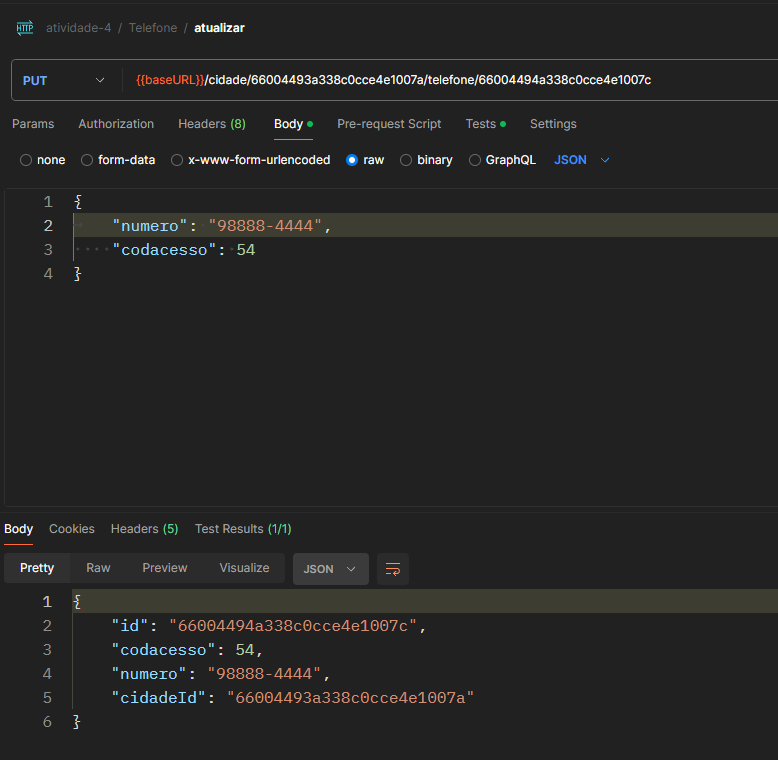
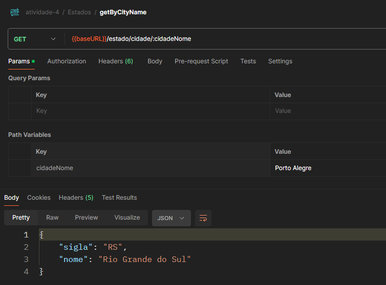
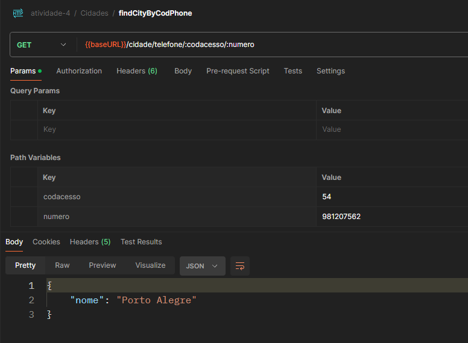
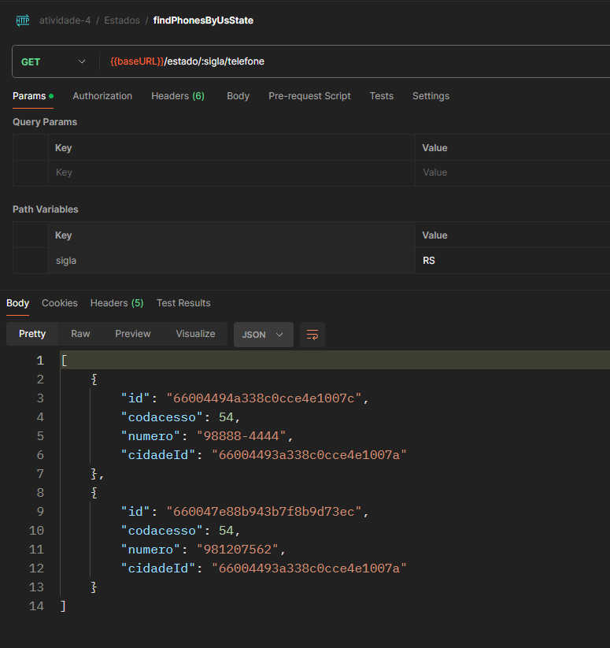
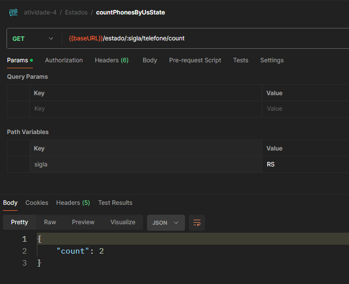
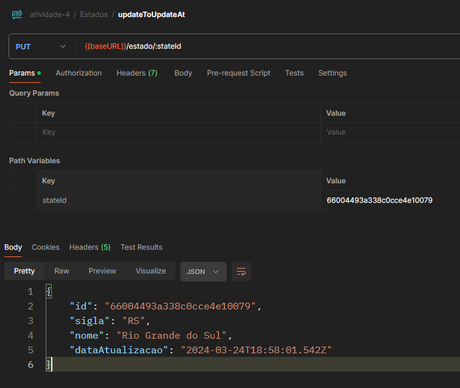
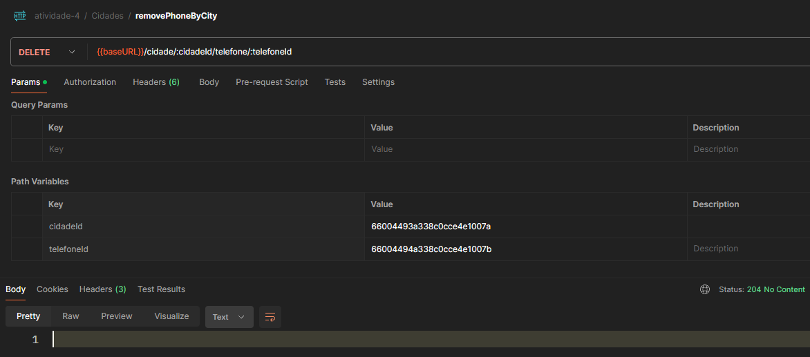

# Atividade 4

## Operações de Manipulação

Considerando a coleção de telefones, realize as seguintes operações de manipulação:

1. Criar uma coleção de cidades através do script disponibilizado

2. Inserir 2 novos telefones em uma cidade do estado do RS (de sua escolha)

3. Modificar o telefone da cidade de Passo Fundo, RS

4. Obter a sigla e o nome do estado que tem uma cidade chamada "Campo dos Goytacazes"

5. Obter o nome da cidade que possui codacesso = 47 e numero = "217-6320"

6. Obter todos os telefones do estado de sigla TO

7. Contar quantos telefones há no estado de sigla RS

8. Adicionar ao estado do RS um atributo "dataAtualizacao", contendo a data de hoje.

9. Remover um telefone de uma cidade e estado de sua escolha.

## Print das Collections no Postman

Aqui estão os campos para print das collections no Postman:

1. Coleção de Cidades:
    - Endpoint: /cidades
    - Método: GET

2. Inserir Telefones:
    - Endpoint: /cidade/:cidadeId/telefone
    - Método: POST
    - Corpo da Requisição:
      - 

3. Modificar Telefone:
    - Endpoint: /cidade/:cidadeId/telefone/:telefoneId
    - Método: PUT
    - Corpo da Requisição:
      - 

4. Obter Estado por Cidade:
    - Endpoint: /estado/cidade/:cidadeNome
    - Método: GET
    - Corpo da Requisição:
     - 

5. Obter Cidade por Codacesso e Número:
    - Endpoint: /cidade/telefone/:codacesso/:numero
    - Método: GET
    - Corpo da Requisição:
      - 

6. Obter Telefones por Estado:
    - Endpoint: /estado/:sigla/telefone
    - Método: GET
    - Corpo da Requisição:
      - 

7. Contar Telefones por Estado:
    - Endpoint: /estado/:sigla/telefone/count
    - Método: GET
    - Corpo da Requisição:
      - 

8. Adicionar Atributo de Data de Atualização ao Estado:
    - Endpoint: /estado/:stateId
    - Método: PUT
    - Corpo da Requisição:
      - 

9. Remover Telefone:
    - Endpoint: /cidade/:cidadeId/telefone/:telefoneId
    - Método: DELETE
    - Corpo da Requisição:
      - 